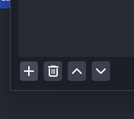

# OBS RealTime Subtitles Plugin #

This plugin is for use with Darwin Intelligence's RealTime subtitles AI product.

Currently in development so some bugs may occur. Requires Internet Access at all times of necessary Transcript/Translation

It is supported on Windows/Linux.

## Requirements

In order to use you will need an API Key which you can sign up for here by emailing - darwinai@darwinai.ai

## Features

- It currently supports the following base languages:
    - Korean (한국어)
    - Chinese (중국어)
    - Japanese (일분어)

## Installation (Windows)
To install this plugin, you will need the openssl library. To do so, you will use the windows installation tool Chocolatey. Installation steps are shown below. You can also find them by visiting the Chocolatey website (https://chocolatey.org/install).
1. Open a powershell terminal on your windows PC in Administrator mode. 
2. Paste the following command into your terminal and press enter.
   Set-ExecutionPolicy AllSigned or Set-ExecutionPolicy Bypass -Scope Process
3. Now, to install chocolatey, paste the following command into your terminal.
   Set-ExecutionPolicy Bypass -Scope Process -Force; [System.Net.ServicePointManager]::SecurityProtocol = [System.Net.ServicePointManager]::SecurityProtocol -bor 3072; iex ((New-Object System.Net.WebClient).DownloadString('https://community.chocolatey.org/install.ps1'))
4. Now that Chocolatey is installed, you can paste the following command into your terminal. This installs openssl.
   choco install openssl
   a. Note, if the choco command doesn't work, you may have to close your terminal and repeat step 1.
5. Next you must copy Darwin's translator plugin into your obs plugin folder.
   a. Copy the two files recieved from Darwin. 
   b. Paste them into your obs plugins folder. Usually this is located at "C:\Program Files\obs-studio\obs-plugins\64bit" 
6. Darwin Translation is now ready to use!

## Usage

1. Add a source for each microphone source (BJ) 
1. Slect Create new and name accordingly to person who will use mic 
1. Select Source Properties 
1. Select Audio Device and close 
1. Select Filters 
1. Click + 
1. Select Darwin Translation 
1. Set filter name accordingly 
1. Select languages, if you want the transcript and translation to appear select both boxes or one or the other 
1. Select Text Source 
1. Select Font 
1. Select Writing system of output language 
1. Pick any font you prefer 
1. If speech has occured text will appear 
1. Enter properties of text source 
1. Set log lines and height and width of box 
1. Example Layout for Korean Text 

## Troubleshooting
Here are some common issues from OBS and how to fix them for the plugin.
### When OBS opens, the subtitles are still there, but they aren't translating.
To fix this, click on the audio source -> filters -> and then toggle the translate or transcribe (whichever you want) off and on again. That will begin translation again.
### Translation doesn't start right away
This is normal. When a filter is started, it takes a few seconds to begin translating.
### Any other problem
If any other problem appears, please email Darwin AI. A common fix is deleting all of the sources with filters on it, exiting OBS, and then readding the sources. This is a project still under development so while the version you are using should be stable, there are still changes being made that could cause small issues. Once the translator is running, there should be no issues.
